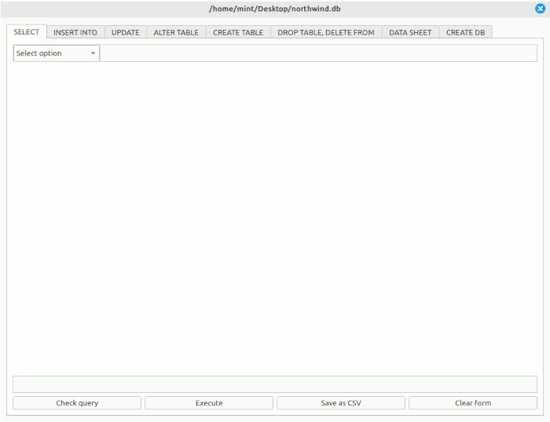

# SQLite Browser with PyQt6

### About:

- This is an application similar to 'DB Browser for SQLite'. 
- This application offers most of the query options. 

### Features:

- Avoids spelling errors.
- It can be faster and easier to run queries because, each time an item is selected from the comboBox, the next comboBox displays the available query options. 

### Requirements:

- PyQt6
- Pandas 2.2.3
- Python 3.10 or higher

For this example I have used this database: 
https://en.wikiversity.org/wiki/Database_Examples/Northwind/SQLite

