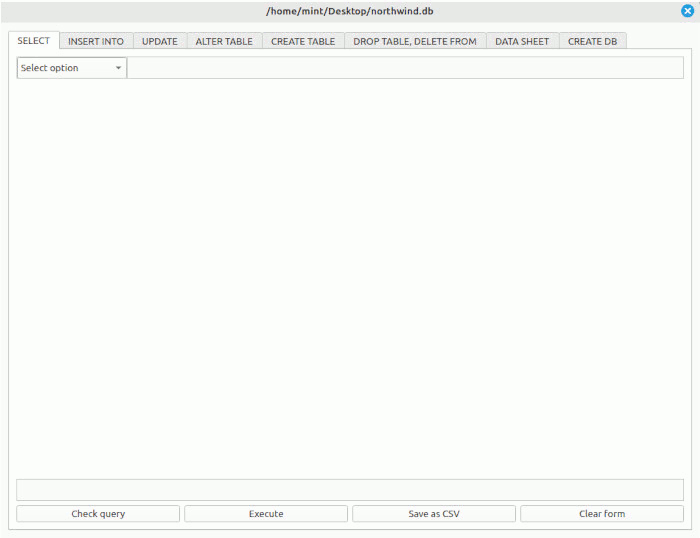

# DB Browser for SQLite with PyQt6

A desktop GUI application for browsing and managing SQLite databases, built with Python and PyQt6. It provides a visual interface for the most common SQL operations without needing to write queries manually.

---

## Table of Contents

- [Features](#features)
- [Screenshots](#screenshots)
- [Requirements](#requirements)
- [Installation](#installation)
- [Usage](#usage)
- [Project Structure](#project-structure)
- [SQL Operations](#sql-operations)
- [Architecture](#architecture)
- [Known Limitations](#known-limitations)
- [License](#license)

---

## Features

- **Open or create** SQLite `.db` database files through a file dialog
- **SELECT** queries with support for:
  - `SELECT`, `SELECT *`, `SELECT ALL`, `SELECT DISTINCT`
  - Aggregate functions: `COUNT`, `SUM`, `AVG`, `MIN`, `MAX`
  - `WHERE` with operators `=`, `>`, `<`, `>=`, `<=`, `<>`, `BETWEEN`, `LIKE`, `IN`, `IS NULL`, `EXISTS`, subqueries
  - `JOIN` (INNER, LEFT, RIGHT, FULL) with up to two join levels
  - `GROUP BY`, `HAVING`, `ORDER BY`, `UNION`
  - `CASE WHEN … THEN … ELSE … END` expressions
  - `LIMIT` clause
- **INSERT INTO** new rows into existing tables
- **UPDATE** one or two fields with a `WHERE` condition
- **ALTER TABLE**: `ADD`, `DROP COLUMN`, `RENAME COLUMN`
- **CREATE TABLE** with field types, `NOT NULL`, `PRIMARY KEY`, `AUTOINCREMENT`, `UNIQUE`, and up to 3 `FOREIGN KEY` constraints
- **DROP TABLE / DELETE FROM** with optional `WHERE` filter and AUTOINCREMENT reset
- **Data Sheet** tab: browse the full contents of any table in a scrollable grid
- **Export** SELECT results to CSV
- **Live SQL preview** before executing any operation
- **Restart** the application to load a newly created database

---

## Screenshots

For this example I have used this database:<br />
https://en.wikiversity.org/wiki/Database_Examples/Northwind/SQLite

<p align="center"></p>

---

## Requirements

| Dependency | Version |
|---|---|
| Python | ≥ 3.10 |
| PyQt6 | ≥ 6.4 |
| pandas | ≥ 1.5 |

---

## Installation

**1. Clone the repository**

```bash
git clone https://github.com/Ferlola/sqlite-browser.git
cd sqlite-browser
```

**2. Create and activate a virtual environment (recommended)**

```bash
python -m venv venv
# Linux / macOS
source venv/bin/activate
# Windows
venv\Scripts\activate
```

**3. Install dependencies**

```bash
pip install PyQt6 pandas
```

**4. Run the application**

```bash
python browser_sql.py
```

---

## Usage

When the application launches, two buttons are shown:

- **Create DATABASE** — opens a form to create a new `.db` file. After creation, click *Restart* to reload the application and select the new database.
- **Search DATABASE** — opens a file dialog to select an existing `.db` file. Once selected, all operation tabs are loaded automatically.

Each tab follows the same workflow:

1. Fill in the form controls (combos, text fields, checkboxes).
2. Click **Check** to preview the generated SQL sentence.
3. Click **Execute** to run it against the database.

---

## Project Structure

```
sqlite-browser/
│
├── browser_sql.py              # Entry point — main window and tab orchestration
│
└── src/
    ├── AlterSql/
    │   ├── alter_sql.py        # ALTER TABLE tab (ADD, DROP COLUMN, RENAME COLUMN)
    │   └── table_alter.py      # Form controls for ALTER TABLE
    │
    ├── CreateDb/
    │   ├── create_db.py        # CREATE DB tab
    │   └── table_create_db.py  # Form controls for database creation
    │
    ├── CreateSql/
    │   ├── create_sql.py       # CREATE TABLE tab
    │   └── table_create_table.py  # Dynamic column-definition form
    │
    ├── DataSheetSql/
    │   ├── table_data_sql.py   # DATA SHEET tab
    │   └── table_data_sheet.py # Table browser grid
    │
    ├── DropSql/
    │   ├── drop_sql.py         # DROP TABLE / DELETE FROM tab
    │   └── table_drop.py       # Form controls for DROP / DELETE
    │
    ├── InsertSql/
    │   ├── insert_sql.py       # INSERT INTO tab
    │   └── table_insert.py     # Dynamic value-entry form
    │
    ├── SelectSql/
    │   ├── select_sql.py       # SELECT tab — orchestrates all sub-forms
    │   ├── result_select_sql.py # Results window (QDialog)
    │   ├── table_select.py     # SELECT type combo + visibility control
    │   ├── table_tables.py     # FROM clause + LIMIT
    │   ├── table_fields.py     # Field selector (multi-checkbox)
    │   ├── table_fields2.py    # Secondary field selector
    │   ├── table_where.py      # WHERE clause (all operators + subqueries)
    │   ├── table_and.py        # AND/OR condition (first)
    │   ├── table_and_or.py     # AND/OR condition (second)
    │   ├── table_join.py       # JOIN clause
    │   ├── table_groupby.py    # GROUP BY clause
    │   ├── table_having.py     # HAVING clause
    │   ├── table_orderby.py    # ORDER BY clause
    │   ├── table_union.py      # UNION clause
    │   ├── table_distinct.py   # DISTINCT selector
    │   ├── table_count.py      # COUNT aggregate
    │   ├── table_avg.py        # AVG aggregate
    │   ├── table_sum.py        # SUM aggregate
    │   ├── table_select_sum.py # SELECT SUM with multiplier
    │   └── table_case.py       # CASE WHEN expression
    │
    ├── UpdateSql/
    │   ├── update_sql.py       # UPDATE tab
    │   └── table_update.py     # Form controls for UPDATE
    │
    └── UtilsSql/
        ├── connect_db.py       # Base DB mixin — all SQLite query methods
        ├── utils.py            # File dialog — sets global `filename`
        ├── input_file.py       # OpenDialog widget (QFileDialog wrapper)
        ├── messages.py         # Messagebox utility (info / critical / question)
        ├── check_data.py       # Collects SELECT form tokens into a list
        ├── clear_data.py       # Resets all SELECT form controls
        ├── create_model.py     # Creates checkable QStandardItemModel for combos
        ├── get_any_table.py    # Checks whether the DB has any user tables
        ├── get_as_brackets.py  # Wraps alias text in SQL square brackets
        ├── get_comillas.py     # Wraps values in the appropriate SQL quote type
        ├── split_text.py       # Splits long SQL strings into display lines
        ├── table_foreignkey.py # FOREIGN KEY section for CREATE TABLE
        └── table_structure.py  # Displays CREATE TABLE SQL in a preview bar
```

---

## SQL Operations

### SELECT

The SELECT tab exposes the full range of SQLite query options through a dynamic form. Controls appear and disappear as you build your query. The final SQL sentence is previewed live before execution. Results open in a separate scrollable window and can be exported to CSV.

### INSERT INTO

Select a table — the form automatically generates one input field per non-PK column. Fill in the values and execute. Primary key columns are excluded since they are managed by `AUTOINCREMENT`.

### UPDATE

Select a table and up to two `SET field = value` pairs. A `WHERE field = value` condition is required to target specific rows.

### ALTER TABLE

Three operations are available: `ADD` (new column with type), `DROP COLUMN`, and `RENAME COLUMN … TO …`. The current table structure is shown in a preview bar above the form.

### CREATE TABLE

Define any number of columns (Add/Remove Field buttons), each with a data type and optional constraints. Up to three `FOREIGN KEY … REFERENCES` clauses can be added if other tables already exist in the database.

### DROP TABLE / DELETE FROM

`DROP TABLE` removes the entire table. `DELETE FROM` deletes rows matching an optional `WHERE` condition. When using `DELETE FROM`, a *Reset AUTOINCREMENT* checkbox resets the sequence counter after the delete.

### Data Sheet

Displays all rows of a selected table in a grid. Click `Update` to refresh the view after making changes in other tabs.

---

## Architecture

The application uses a **mixin-based inheritance pattern** throughout. Each form section is implemented as a standalone mixin class (e.g. `TableWhere`, `TableJoin`, `TableGroupBy`) that inherits from `ConnectDb`. The main tab classes then inherit from `QWidget` and all relevant mixins via Python's MRO, composing the full UI from independent, reusable pieces.

```
ConnectDb  ←  TableSelect, TableWhere, TableJoin, TableGroupBy, …
                         ↘
                        Select(QWidget, TableUnion, TableCase, …, TableSelect)
```

`ConnectDb` is the single point of database access. All SQL queries (schema inspection, data retrieval, structure queries) are centralised there, so every mixin automatically has access to the current database without passing connections around.

---

## Known Limitations

- The application must be **restarted** after creating a new database to load it.
- `MODIFY COLUMN` is defined in `TableAlter` but not exposed in the UI, as SQLite does not natively support this operation.
- The `get_fields_table_by` method relies on `cursor.description` and requires the table to have at least one row to return field names reliably.
- CSV export saves to `rename_this.csv` in the current working directory — rename the file after export.

---

## License

This project is released under the MIT License.
